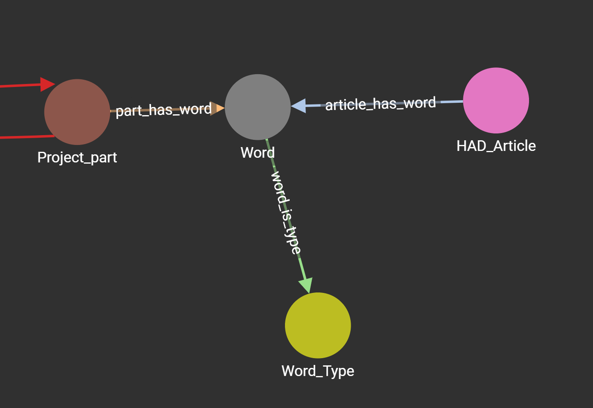

# Project Part Graph

## Purpose
The purpose of this project is to link compatible electronics hobby parts to projects found across the web. Many electronics projects have interchangable components, just because that project you saw online used a LIS3DH accelerometer doesn't mean the BNO055 that you have at home won't work. The purpose is to make it easy to discover parts usable within a project domain.

## Execution
To gather the data necessary for this project I started at the most common electronics hobby sites. [Adafruit](https://www.adafruit.com/) for the parts supplier (with [Pololu](https://www.pololu.com/) added later) and [HackADay](https://hackaday.com/) for the source of projects.

I (ethically) scraped all product and article data from the aforemoentioned websites. The scripts used for which can be found in the `tools` folder. 

Once I had all my product and article data I needed to be able to link parts to projects. Some HAD articles feature a list of parts, but most do not and instead mention parts throughout the body of the article. I utilized NLP and regex to parse part names and other potentially interesting words. Most part names follow a patters of two or more letters followed by two or more letters potentially followed by another letter. The code for parsing out words can be found in `tools/extract_words.py`. I parsed the name and description of all products and the title and body of all HAD articles.

Now that I had collections of: products, articles, and words representing each of them, I could load the graph.

The graph schema connects parts and articles by words that they share. In order to see how closely a part and an article realte, we can simply count the number of words that they share. Jaccard similarity can be used with the lists of words for any given article / part combination. Jaccard similarity possibly penalizes longer aritcles or descriptions due to a higher probability of non-matching words. This could be corrected in the future by weighting hobby specific words (after identifying them of course).

## Getting it all running
The first thing you'll need to do is sourece your data. The three `<source>_scrape.py` each scrape relevant data from their namesake. This data is saved as a json, but then needs to be processed by `jsonToCSV.py` into a .csv for loading through the TigerGraph web interface.

Once the `<data>.csv`'s are created, we can begin extracting the words. Run `extract_words.py` appropriately selecting the inFile and scraping columns to fit each .csv. You now have all the files needed to begin loading your data into TigerGraph.

**Schema and graph setup information to come**